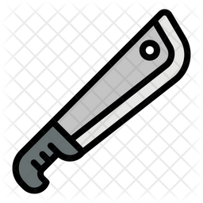

# Machete - 无数据库、基于文件和目录的Markdown文档、网址导航、图书、图片、视频网站PHP开源系统



**Markdown**及其编辑器的普及，以及类似Jekyll**以文件为基础**的博客系统的出现，为博主们提供了一种**更为专注**的写作方式，
在自己的电脑本地且不必联网的情况下就能创作，不再依赖于像WordPress这类系统后台。

对于喜欢写作的创作者们，显然已经从Markdown的使用中由原来的在线编辑转为本地编辑获得了更高的自由度和效率，
除了博客，放眼到其它行业，基于文件、目录就能管理内容的典型还有代码托管（如Github）、网盘和云存储（如iCloud），
那我们何不把这个成功的经验推广到更多的内容创作领域，如：小说、摄影、播客，帮助创作者简化将内容制作成网站的工作，
于是**FileSite.io**诞生了。


## 愿景

**进一步降低内容分享者、创作者把内容变成网站的门槛**，
以常见的本地磁盘目录+文件的形式作为网站数据来源，
修改磁盘文件内容上传到服务器就可以生成网页，
让大家更易于同时维护本地和网站的内容。

FileSite.io希望帮助到他们：
* 图片网站经营者、摄影师、摄影爱好者、驴友
* 视频网站经营者、播客、摄影师、航拍爱好者、运动爱好者、潜水爱好者
* 经常用Markdown写文档/文章的朋友
* 网址导航站经营者、收藏夹/网址分享者


## Docker使用视频教程

在Docker中如何用filesite/machete源码快速搭建支持文件/目录管理内容的图片网站、视频网站、导航网站和文档站的视频教程。

主要步骤：
1. docker pull filesite/machete
2. docker run ...
3. 本地测试网站和后台
4. 在docker容器中升级最新版
5. <del>如何在macos中挂载远程磁盘来管理图片等内容</del>（samba版不再维护，如有需要请自行研究）

视频教程：

<div style="max-width:1024px">
  <video width="100%" preload="metadata" playsinline controls poster="https://static.jialuoma.cn/img/video_docker_pull_run_machete_1210_snap.png">
    <source src="https://static.jialuoma.cn/mp4/video_docker_pull_run_machete_1210.mp4" type="video/mp4">
  </video>
</div>


## 使用流程

Machete使用非常简单，一旦部署好之后，以后只需将本地最新内容上传覆盖即可。

1. 参考上面“Docker使用视频教程“下载、安装Machete；

  也支持手动部署，请参考Machete源码根目录下的README.md文档。

2. 修改配置文件``config/app.php``，简单设置后上传到服务器完成部署；

  指定内容目录和使用的皮肤：
```
'content_directory' => 'content/',      //内容存放目录
'theme' => 'manual',                    //皮肤名称，如：文档站选manual，图片站选googleimage
```

3. 将本地内容目录及文件上传到网站目录：``www/content/``

  不同皮肤请上传到对应的目录，详情参考Machete源码README.md文档。

4. 打开网址浏览最新内容；

有了Machete，你可以**保留现有的本地内容创作习惯**，并非常容易地把它们制作成一个网站分享给他人。


## 在线体验

Machete是单入口模式PHP源码，**不支持子目录方式访问**，以下示例都是以子域名或根域名配置nginx根目录指向代码目录下的www/index.php。

| 类型 | 名称 | 网址 |
| ---- | ---- | ---- |
| 图片站 | 家庭相册演示 | <a href="https://demo.jialuoma.cn" target="_blank">Demo</a> |
| 视频分享站 | Ta荐 | <a href="https://tajian.tv" target="_blank">TaJian.tv</a> |
| 文档站 | FileSite | <a href="https://filesite.io" target="_blank">Filesite.io</a> |
| 导航站 | 站长手册 | <a href="https://webdirectory.filesite.io" target="_blank">WebDir</a> |


## 源码下载

Machete是砍刀，它能砍、能削、能切、能剁，最适合披荆斩棘；

砍刀不像大刀、长剑、长矛为战场而生，但在日常生活中使用也是得心应手。

Filesite.io也一样，它短小精悍，使用它把常见的本地文件制作成网站，就像拿起砍刀一样简单， 所以我们将FileSite.io的源码命名为**machete**。

点击下面网址查看源码或者下载源码：

* 查看<a href="https://github.com/filesite-io/machete" target="_blank">FileSite-io/Machete</a>。

* 用git下载：
```
git clone https://github.com/filesite-io/machete.git
```

* 下载zip压缩包（[点我直接下载](https://github.com/filesite-io/machete/archive/refs/heads/main.zip)）：
```
https://github.com/filesite-io/machete/archive/refs/heads/main.zip
```

* 从Docker Hub下载镜像：
```
docker pull filesite/machete
```

  启动容器：
```
docker run --name machete -p 1080:80 -itd filesite/machete
```

更多使用说明见Machete源码README.md。


## 皮肤介绍

FileSite.io官方提供的皮肤都包含在最新版的源码目录```themes/```中，详情如下：

| 皮肤名称 | 皮肤目录 | 适用网站类型 |
| ---- | ---- | ---- |
| Beauty | beauty | 图片站 |
| TaJian | tajian | 视频分享站 |
| WebDirectory | webdirectory | 导航站 |
| Manual | manual | 文档站 |
| GoogleImage | googleimage | 图片站 |
| VideoBlog | videoblog | 视频站 |


**说明**：
目前以图片站、视频分享站为主，其它几个类型暂停维护。


## 使用手册

如果要基于Machete做二次开发，请先仔细阅读下面手册。

FileSite.io核心代码参考：
* [Filesite.io core lib](./FSC.md)
* [Nginx配置示例](./Nginx.conf.md)

FileSite.io二次开发参考：
* [FileSite.io使用手册](./Manual.md)
* [类DirScanner定义](./Class_DirScanner.md)


如果上面的手册还不能帮助解决你的问题，
请按下面方式提交反馈与建议。


## 反馈与建议

如果使用中遇到任何问题，
请在下面仓库提出：

* <a href="https://github.com/filesite-io/machete/issues" target="_blank">去Github提交问题/反馈</a> (海外推荐使用)
* <a href="https://gitcode.net/filesite/machete/-/issues" target="_blank">去Gitcode提交问题/反馈</a> (国内推荐使用)

如果觉得好用，别忘了点仓库右上角**⭐星号**加收藏以示支持。


## 联系我们

请打开官方网站查看底部QQ群和微信：
<a href="https://filesite.io" target="_blank">FileSite.io</a>
